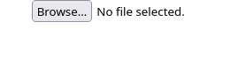
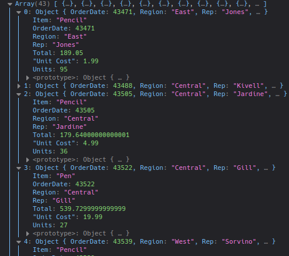

## React Typescript XLSX

### Getting Started


```
npm install
```
```
npm run start
```

### How to Use

Drag and Drop file (.xlsx) in browser file


<br>

(Sample Data in directory "assets") or other file similar structure


### Output in Console

